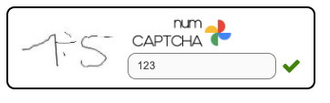

@someone else please prettify this.. make it look professional (actual link to script is not uploaded yet...)

---

<div align="center">
  
</div>

<br />

numCaptchaJS is a _Javascript_ Library that allows you to use <u>numCAPTCHA</u> easily on your website.

<br />

<div align="center">
  
</div>

---

### Usage

In your index.html, numCaptcha dynamically renders in a `<div>` tag with the id of `captcha-wrapper`

```html
<body>
	<div id="captcha-wrapper"></div>
</body>
```

<br />

You also need to import the script using a script tag

```html
<script src="https://numcaptcha.s3.amazonaws.com/lib/numCaptchaJS/main.js"></script>
```

> :warning: Remember to import numCaptchaJS <u>after</u> the \<body\> tag

<br />

After importing the script, you would have access to the `useNumCaptcha()` function in the global `windows` object. The function returns a promise which resolves with the value of `true` when user completes <u>numCAPTCHA</u>.

```js
window.useNumCaptcha().then((res) => {
	// do something
});
```
